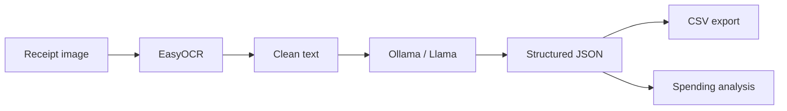

# Receipt Sense

A local, offline tool that reads receipt images, extracts spending details with AI, saves them to CSV, and summarizes your spending habits—without sending data to the cloud.

---

## 1. Project Overview

**Receipt Sense** scans photos of receipts (JPG/PNG), turns them into text with OCR, then uses a local Llama model to pull out structured fields (merchant, date, total, items, and more). Results are written to a CSV file, and the model can suggest simple spending insights.

Everything runs on your machine: images stay local, and the LLM is served through [Ollama](https://ollama.com/).

---

## 2. Tools

| Tool | Role |
|------|------|
| **Python 3** | Main language and orchestration |
| **EasyOCR** | Reads text from receipt images (CPU-friendly) |
| **Ollama** | Runs the Llama model locally via HTTP |
| **python-dotenv** | Loads settings (e.g. model name) from `.env` |
| **CSV / JSON** | Stores extracted rows and analysis output |

**Optional / experimental**

- `scripts/extract_and_generate.py` — standalone script using `llama-cpp-python` instead of Ollama
- `mock_scripts/` — small examples for testing Llama locally

---

## 3. Model Used + Installation

### Model

The project is built for **Llama 3.2 3B Instruct** (quantized GGUF), for example:

`hf.co/bartowski/Llama-3.2-3B-Instruct-GGUF:Q4_K_M`

Set the exact name in `.env` as `MODEL_NAME` (see below).

### Prerequisites

1. **Python 3.10+** installed
2. **Ollama** installed from [https://ollama.com/download](https://ollama.com/download)

### Setup steps

```bash
# Clone or open the project, then create a virtual environment (recommended)
python -m venv .venv
.venv\Scripts\activate          # Windows
# source .venv/bin/activate     # macOS / Linux

# Install Python dependencies
pip install easyocr ollama python-dotenv

# Pull the model into Ollama (use the same name as in .env)
ollama pull hf.co/bartowski/Llama-3.2-3B-Instruct-GGUF:Q4_K_M
```

Create a `.env` file in the project root:

```env
MODEL_NAME=hf.co/bartowski/Llama-3.2-3B-Instruct-GGUF:Q4_K_M
```

On first run, EasyOCR downloads English language weights automatically (one-time, needs internet).

### Run

1. Put receipt images in the `receipts/` folder (`.jpg`, `.jpeg`, `.png`).
2. From the project root:

```bash
python main.py
```

3. Check `output/spending_data.csv` for extracted rows.

To verify Ollama is working:

```bash
python src/tests/test_ollama.py
```

---

## 4. Architecture of Tools

Data flows through four stages. Each stage is a separate module so you can change OCR or the LLM without rewriting the whole app.



| Stage | Module | What it does |
|-------|--------|----------------|
| 1. Scan | `src/ocr_reader.py` | Image → raw text |
| 2. Clean | `OCRReader.clean_text()` | Fixes spacing and common OCR mistakes |
| 3. Extract | `src/llm_extractor.py` | Sends text + JSON schema to Ollama; returns fields like merchant, date, total, items |
| 4. Orchestrate | `src/pipeline.py` | Runs all receipts, saves CSV, calls analysis |
| Config | `src/config.py` | Paths, model name, temperatures, JSON schema |

**Entry point:** `main.py` creates folders, runs `ReceiptPipeline`, saves CSV, and prints analysis JSON.

---

## 5. Project Structure

```
receipts_with_llama/
├── main.py                 # Run this to process all receipts
├── .env                    # MODEL_NAME (not committed; create locally)
├── receipts/               # Input: your receipt images
├── output/                 # Output: spending_data.csv
├── src/
│   ├── config.py           # Paths, model settings, receipt JSON schema
│   ├── ocr_reader.py       # EasyOCR wrapper
│   ├── llm_extractor.py    # Ollama chat + JSON extraction / analysis
│   ├── pipeline.py         # End-to-end workflow
│   └── tests/
│       └── test_ollama.py  # Quick Ollama connectivity check
├── scripts/
│   └── extract_and_generate.py   # Alternate: llama-cpp + EasyOCR script
└── mock_scripts/           # Learning examples (llama_cpp, few-shot)
```

---

## 6. Future Improvements

- Add a `requirements.txt` (or `pyproject.toml`) for reproducible installs
- Support PDF receipts and more image formats in the main pipeline
- Align CSV column names with the JSON schema (merchant vs. vendor fields)
- Add `Config.setup()` and a single schema constant used by `pipeline.py` and `config.py`
- Optional GPU for EasyOCR on supported hardware
- Simple web UI or dashboard for uploads and charts
- Stronger validation and retry when the model returns invalid JSON
- Category rules or budgets without relying only on the LLM

---

## Quick tips for beginners

- **No receipts processed?** Ensure files are in `receipts/` and named `.jpg`, `.jpeg`, or `.png`.
- **Ollama errors?** Confirm `ollama list` shows your `MODEL_NAME` and Ollama is running.
- **Slow first run?** EasyOCR and the model load once; later receipts are faster.
- **Privacy:** Processing is local; only model downloads need the network.
